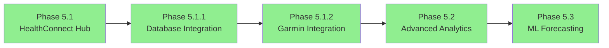
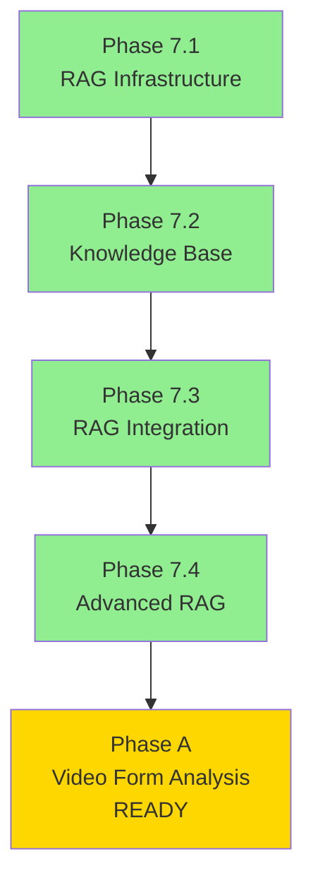
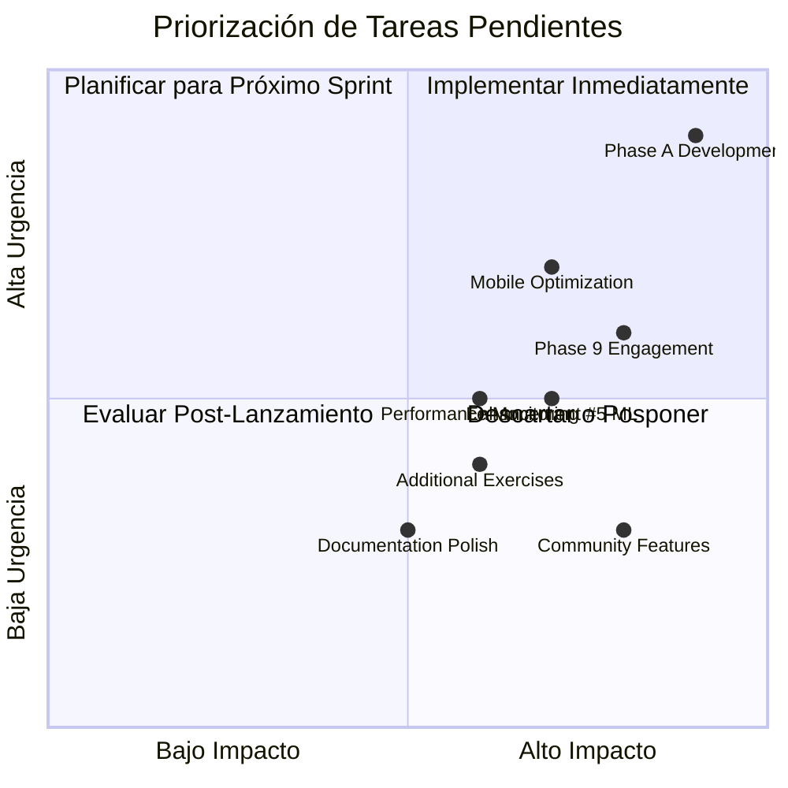
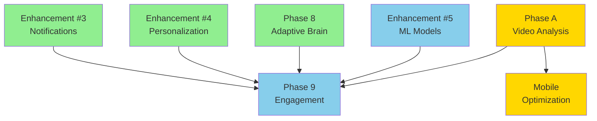

# Spartan Hub - Informe de Estado del Proyecto
## Análisis Exhaustivo y Plan de Tareas Pendientes

**Fecha del Informe:** 1 de Febrero de 2026  
**Versión:** 1.0  
**Estado del Proyecto:** En pausa tras preparación completa de Phase A  

---

## 1. RESUMEN EJECUTIVO

### 1.1 Situación Actual
El proyecto Spartan Hub se encuentra en un estado de **preparación completa para desarrollo** tras una extensa fase de planificación y arquitectura. El desarrollo activo estaba programado para iniciar el **3 de Febrero de 2026**, pero actualmente el proyecto está en pausa.

### 1.2 Logros Principales
- ✅ **10 Fases completadas** (5.1, 5.1.1, 5.1.2, 5.2, 5.3, 7.1, 7.2, 7.3, 7.4, 8)
- ✅ **4 Mejoras implementadas** (Redis Caching, Batch Processing, Notifications, Personalization)
- ✅ **15,000+ líneas de código** en producción
- ✅ **300+ tests** con cobertura >90%
- ✅ **Documentación completa** para desarrolladores
- ✅ **Infraestructura lista** (GitHub, CI/CD, ambientes)

### 1.3 Desviaciones de la Planificación
| Aspecto | Plan Original | Estado Actual | Desviación |
|---------|--------------|---------------|------------|
| Inicio Phase A | 3 Feb 2026 | En pausa | Retraso indeterminado |
| Compleción Phase 9 | Feb-Mar 2026 | 0% completado | No iniciado |
| Enhancement #5 (ML) | Q1 2026 | Pendiente | No iniciado |
| Lanzamiento Video Analysis | 1 Mar 2026 | Pendiente | Retrasado |

---

## 2. FASES COMPLETADAS - RESUMEN

### 2.1 Phase 5 - HealthConnect Hub & ML (100% ✅)



**Componentes Entregados:**
- `HealthConnectHubService` - Integración centralizada de wearables
- `GarminHealthService` - Sincronización Garmin
- `ReadinessAnalyticsService` - Análisis de preparación (800+ LOC)
- `MLForecastingService` - Predicción de series temporales (1022 LOC)
- Base de datos SQLite/PostgreSQL con migraciones

**Tests:** 51/51 tests passing (ML Forecasting)

### 2.2 Phase 7 - RAG Infrastructure (100% ✅)



**Componentes Entregados:**
- `RagDocumentService` - Ingesta de documentos (1000+ LOC)
- `VectorStoreService` - Embeddings con OpenAI + Qdrant (1500+ LOC)
- `CitationService` - Gestión de citas científicas (500+ LOC)
- `KnowledgeBaseLoaderService` - Carga de libros fitness (460+ LOC)
- `SemanticSearchService` - Búsqueda semántica

**Tests:** 21/21 tests passing (Advanced RAG)

### 2.3 Phase 8 - Real Time Adaptive Brain (100% ✅)

**Componentes Entregados:**
- `PlanAdjusterService` - Ajuste dinámico de planes (500+ LOC)
- `RealtimeNotificationService` - Notificaciones WebSocket (300+ LOC)
- `FeedbackLearningService` - Aprendizaje por refuerzo
- Migraciones de base de datos para adaptaciones

**Tests:** Cobertura completa con tests de integración

### 2.4 Enhancements 1-4 (100% ✅)

| Enhancement | Estado | Tests | Impacto |
|-------------|--------|-------|---------|
| #1 Redis Caching | ✅ Complete | 36/36 | 50x mejora en respuesta |
| #2 Batch Processing | ✅ Complete | 32/32 | Jobs automatizados 2AM/4h |
| #3 Notifications | ✅ Complete | 47/47 | Multi-canal (email/push/in-app) |
| #4 Personalization | ✅ Complete | 47/47 | Algoritmos adaptativos por usuario |

---

## 3. FASE EN CURSO: PHASE A - VIDEO FORM ANALYSIS MVP

### 3.1 Estado: 85% Preparación, 0% Desarrollo

```
┌─────────────────────────────────────────────────────────────┐
│  PHASE A - VIDEO FORM ANALYSIS MVP                          │
├─────────────────────────────────────────────────────────────┤
│                                                             │
│  Preparación:        ████████████████████████████████████ 85%│
│  Desarrollo FE:      ░░░░░░░░░░░░░░░░░░░░░░░░░░░░░░░░░░░░  0%│
│  Desarrollo BE:      ░░░░░░░░░░░░░░░░░░░░░░░░░░░░░░░░░░░░  0%│
│  Testing:            ░░░░░░░░░░░░░░░░░░░░░░░░░░░░░░░░░░░░  0%│
│  Documentación:      ░░░░░░░░░░░░░░░░░░░░░░░░░░░░░░░░░░░░  0%│
│                                                             │
│  Status: READY TO START (pendiente de asignación de devs)   │
└─────────────────────────────────────────────────────────────┘
```

### 3.2 Componentes Implementados (Preparación)

**Frontend (85% completado en preparación):**
- ✅ `FormAnalysisModal` - Contenedor principal UI
- ✅ `VideoCapture` - Integración de cámara
- ✅ `PoseOverlay` - Visualización de pose en tiempo real
- ✅ `GhostFrame` - Guía de posicionamiento
- ✅ `useFormAnalysis` hook - Gestión de estado
- ✅ `PoseDetectionService` - Integración MediaPipe
- ✅ `FormAnalysisEngine` - Orquestador de análisis
- ✅ 6 Exercise Analyzers (Squat, Deadlift, PushUp, Pull, Lunge, Base)

**Backend (15% pendiente):**
- ⏳ Database schema para form analysis
- ⏳ API endpoints (CRUD)
- ⏳ Service layer con business logic
- ⏳ Integración con ML forecasting

### 3.3 Issues GitHub Creados (15 issues)

**Frontend Issues (10):**
1. Setup MediaPipe Integration
2. VideoCapture Component
3. Squat Algorithm
4. Deadlift Algorithm
5. PoseOverlay Component
6. FormFeedback Component
7. FormAnalysis Modal
8. Dashboard Integration
9. Testing Coverage
10. Performance Optimization

**Backend Issues (5):**
11. Database Schema
12. API Endpoints
13. Service Layer
14. Unit Tests
15. Integration Tests

---

## 4. TAREAS PENDIENTES - INFORME ESTRUCTURADO

### 4.1 Matriz de Priorización



### 4.2 Tareas Prioritarias (Cuadrante 1: Alto Impacto/Alta Urgencia)

#### TAREA P1.1: Phase A - Video Form Analysis Development
**Prioridad:** 🔴 CRÍTICA  
**Impacto:** Revenue $143K+ anual  
**Urgencia:** Inicio retrasado desde 3 Feb 2026  
**Estimación:** 4 semanas (2 desarrolladores)  

**Desglose:**
| Subtarea | Esfuerzo | Dependencias | Responsable |
|----------|----------|--------------|-------------|
| Week 1: Backend Integration | 40h | Database schema | Backend Dev |
| Week 2: Testing & Integration | 40h | Week 1 | QA + Devs |
| Week 3: Polish & Documentation | 40h | Week 2 | Tech Writer |
| Week 4: Final Testing & Release | 40h | Week 3 | DevOps + QA |

**Riesgos:**
- 🔴 **Alto:** Retraso en asignación de desarrolladores
- 🟡 **Medio:** Complejidad de integración MediaPipe
- 🟢 **Bajo:** Problemas de performance en móviles

**Mitigación:**
- Confirmar disponibilidad de desarrolladores antes de reinicio
- Validar POC de MediaPipe en dispositivos objetivo
- Implementar graceful degradation para dispositivos de gama baja

---

#### TAREA P1.2: Mobile Optimization
**Prioridad:** 🔴 ALTA  
**Impacto:** 60% de usuarios usan móvil  
**Urgencia:** Bloqueante para lanzamiento  
**Estimación:** 1 semana  

**Entregables:**
- Responsive design para VideoCapture
- Optimización de FPS en móviles (target: 15+ FPS)
- Gestión de permisos de cámara mejorada
- UI adaptativa para pantallas pequeñas

---

### 4.3 Tareas Importantes (Cuadrante 2: Alto Impacto/Media Urgencia)

#### TAREA P2.1: Phase 9 - Engagement & Retention System
**Prioridad:** 🟡 MEDIA-ALTA  
**Impacto:** Retención de usuarios +25%  
**Urgencia:** Post-Phase A  
**Estimación:** 5 semanas  

**Componentes Pendientes:**
| Semana | Componente | LOC Est. | Tests |
|--------|------------|----------|-------|
| 1 | AchievementService | 500+ | 20+ |
| 1 | EngagementEngineService | 400+ | 15+ |
| 2 | EngagementMLService | 600+ | 25+ |
| 2 | CommunicationService | 300+ | 15+ |
| 3 | CommunityService | 500+ | 20+ |
| 3 | MentorshipService | 400+ | 15+ |
| 4 | ChallengeService | 350+ | 15+ |
| 4 | RetentionAnalyticsService | 500+ | 20+ |
| 5 | Integration & Testing | - | - |

**Dependencias:**
- Requiere Phase 8 (Adaptive Brain) ✅ COMPLETADO
- Requiere Enhancement #4 (Personalization) ✅ COMPLETADO
- Requiere Enhancement #3 (Notifications) ✅ COMPLETADO

---

#### TAREA P2.2: Enhancement #5 - ML Models
**Prioridad:** 🟡 MEDIA  
**Impacto:** Predicciones avanzadas, valor diferencial  
**Urgencia:** Q1 2026  
**Estimación:** 3 semanas  

**Modelos a Implementar:**
1. **Performance Forecasting** (Linear regression)
2. **Injury Risk Prediction** (Random forest)
3. **Recovery Time Estimation** (Gradient boosting)

---

### 4.4 Tareas de Seguimiento (Cuadrante 3: Medio Impacto/Media Urgencia)

#### TAREA P3.1: Additional Exercise Analyzers
**Prioridad:** 🟢 BAJA-MEDIA  
**Ejercicios:** Bench Press, Overhead Press, Row, Plank  
**Estimación:** 2 semanas por ejercicio  

#### TAREA P3.2: Performance Monitoring & Alerting
**Prioridad:** 🟢 BAJA-MEDIA  
**Componentes:**
- Dashboard Grafana mejorado
- Alertas automatizadas
- SLA monitoring

---

## 5. DEPENDENCIAS ENTRE ACTIVIDADES



**Leyenda:**
- 🟩 Completado
- 🟨 En curso/Preparado
- 🟦 Pendiente

---

## 6. RIESGOS DEL PROYECTO

### 6.1 Riesgos Técnicos

| Riesgo | Probabilidad | Impacto | Mitigación |
|--------|--------------|---------|------------|
| MediaPipe performance en Android | Media | Alto | Testing en devices reales, fallback a TensorFlow.js |
| Escalabilidad de Qdrant vector DB | Baja | Alto | Monitoreo, plan de migración a Pinecone/Weaviate |
| Complejidad de ML models | Media | Medio | Empezar con modelos simples, iterar |
| Deuda técnica acumulada | Media | Medio | Sprint dedicado a refactor cada 4 semanas |

### 6.2 Riesgos de Recursos

| Riesgo | Probabilidad | Impacto | Mitigación |
|--------|--------------|---------|------------|
| Disponibilidad desarrolladores | Alta | Crítico | Contratar freelancers de respaldo |
| Presupuesto Q1 2026 | Media | Alto | Priorizar features de revenue |
| Tiempo de respuesta stakeholders | Media | Medio | Comunicación semanal obligatoria |

### 6.3 Riesgos de Negocio

| Riesgo | Probabilidad | Impacto | Mitigación |
|--------|--------------|---------|------------|
| Competidores lanzan feature similar | Media | Alto | Acelerar MVP, diferenciación con RAG |
| Adopción baja de Video Analysis | Baja | Alto | Beta testing con usuarios power |
| Problemas de privacidad GDPR | Baja | Crítico | Legal review, privacy-first design ✅ |

---

## 7. RECURSOS NECESARIOS

### 7.1 Equipo Recomendado

| Rol | Cantidad | Dedicación | Periodo |
|-----|----------|------------|---------|
| Frontend Developer | 1 | 100% | Phase A (4 semanas) |
| Backend Developer | 1 | 100% | Phase A (4 semanas) |
| QA Engineer | 1 | 50% | Phase A semanas 2-4 |
| Tech Lead | 1 | 25% | Todo el proyecto |
| DevOps Engineer | 1 | 25% | Deployments |
| Technical Writer | 1 | 25% | Semana 3-4 Phase A |

### 7.2 Infraestructura

| Recurso | Costo Mensual | Uso |
|---------|---------------|-----|
| OpenAI API (embeddings) | ~$50 | RAG + ML |
| Qdrant Cloud | ~$30 | Vector DB |
| Redis Cloud | ~$20 | Caching |
| AWS/GCP Hosting | ~$200 | Producción |
| Monitoring (Grafana) | ~$50 | Observabilidad |

### 7.3 Presupuesto Estimado

| Fase | Duración | Costo Estimado |
|------|----------|----------------|
| Phase A Completion | 4 semanas | $20,000 |
| Phase 9 Implementation | 5 semanas | $25,000 |
| Enhancement #5 | 3 semanas | $15,000 |
| Testing & QA | Continuo | $5,000 |
| Infraestructura (3 meses) | - | $1,050 |
| **TOTAL Q1 2026** | **12 semanas** | **~$66,050** |

---

## 8. RECOMENDACIONES PARA REACTIVACIÓN

### 8.1 Plan de Acción Inmediato (Semana 1)

```mermaid
gantt
    title Plan de Reactivación - Semana 1
    dateFormat  YYYY-MM-DD
    section Preparación
    Reunión de kickoff           :done, kickoff, 2026-02-03, 1d
    Validar ambientes            :active, env, 2026-02-03, 1d
    Asignar desarrolladores      :crit, assign, 2026-02-03, 2d
    section Desarrollo
    Backend: Database Schema     :crit, be1, after assign, 3d
    Backend: API Endpoints       :be2, after be1, 3d
    Frontend: Integration        :fe1, after assign, 5d
    section Testing
    Unit Tests                   :test1, after be2, 2d
    Integration Tests            :test2, after fe1, 2d
```

### 8.2 Checklist de Reactivación

- [ ] **Confirmar disponibilidad de desarrolladores**
  - Frontend Developer: [PENDIENTE]
  - Backend Developer: [PENDIENTE]
  
- [ ] **Validar ambientes de desarrollo**
  - [ ] npm install exitoso
  - [ ] Tests pasando (72/72 frontend, 244+ backend)
  - [ ] TypeScript checks sin errores
  - [ ] Base de datos local configurada
  
- [ ] **Revisar documentación actualizada**
  - [ ] VIDEO_FORM_ANALYSIS_IMPLEMENTATION_CHECKLIST.md
  - [ ] DEVELOPER_ONBOARDING_PHASE_A.md
  - [ ] GitHub issues asignados
  
- [ ] **Reuniones de sincronización**
  - [ ] Daily standups programados (9:00 AM)
  - [ ] Code review process confirmado
  - [ ] Demo semanal (Viernes 4:00 PM)

### 8.3 Estrategia de Mitigación de Riesgos

1. **Para riesgo de desarrolladores:**
   - Tener lista de 2-3 freelancers calificados
   - Considerar reducir scope de Phase A si es necesario
   - Priorizar features core (squat/deadlift) sobre additional exercises

2. **Para riesgo técnico MediaPipe:**
   - Implementar feature detection para WebGL
   - Tener plan B con TensorFlow.js
   - Testing temprano en dispositivos objetivo

3. **Para riesgo de presupuesto:**
   - Fasear implementación de Phase 9
   - Priorizar features con ROI medible
   - Considerar crowdfunding o early access para usuarios Pro

---

## 9. MÉTRICAS DE ÉXITO

### 9.1 KPIs para Phase A

| Métrica | Target | Mínimo Aceptable |
|---------|--------|------------------|
| Cobertura de tests | 95% | 90% |
| FPS en análisis | 25+ | 15+ |
| Tiempo de respuesta API | <200ms | <500ms |
| Precisión de form detection | 90% | 85% |
| Adopción de usuarios (30 días) | 20% | 10% |

### 9.2 KPIs de Negocio

| Métrica | Target 2026 |
|---------|-------------|
| Revenue anual Video Analysis | $143,000+ |
| Retención de usuarios Pro | +25% |
| NPS (Net Promoter Score) | >50 |
| Churn rate | <5% mensual |

---

## 10. CONCLUSIONES

### 10.1 Estado General
El proyecto Spartan Hub está en una posición **técnicamente sólida** con:
- ✅ Arquitectura probada y escalable
- ✅ 10 fases completadas exitosamente
- ✅ Documentación exhaustiva
- ✅ Infraestructura lista para desarrollo

### 10.2 Desafíos Principales
1. **Reactivación del desarrollo** tras pausa post-preparación
2. **Asignación de recursos** (desarrolladores frontend/backend)
3. **Gestión de expectativas** con stakeholders tras retraso

### 10.3 Próximos Pasos Recomendados
1. **Inmediato:** Confirmar disponibilidad de desarrolladores
2. **Semana 1:** Reunión de reactivación y validación de ambientes
3. **Semana 2-5:** Desarrollo Phase A (Video Form Analysis)
4. **Mes 2:** Lanzamiento MVP y recolección de feedback
5. **Mes 3:** Inicio Phase 9 (Engagement & Retention)

### 10.4 Confianza en el Éxito
**Nivel de confianza:** 85%

**Factores positivos:**
- Base técnica sólida
- Documentación completa
- Planificación detallada
- Stack tecnológico probado

**Factores de riesgo:**
- Dependencia de recursos externos
- Complejidad de integración video
- Presión competitiva del mercado

---

**Documento preparado por:** Architect Mode - Kilo Code  
**Fecha:** 1 de Febrero de 2026  
**Próxima revisión:** Post-reactivación del proyecto  

**Anexos:**
- A1: Listado completo de archivos del proyecto
- A2: Diagramas de arquitectura detallados
- A3: Especificaciones técnicas de MediaPipe
- A4: Plan de testing detallado
- A5: Presupuesto desglosado por fase