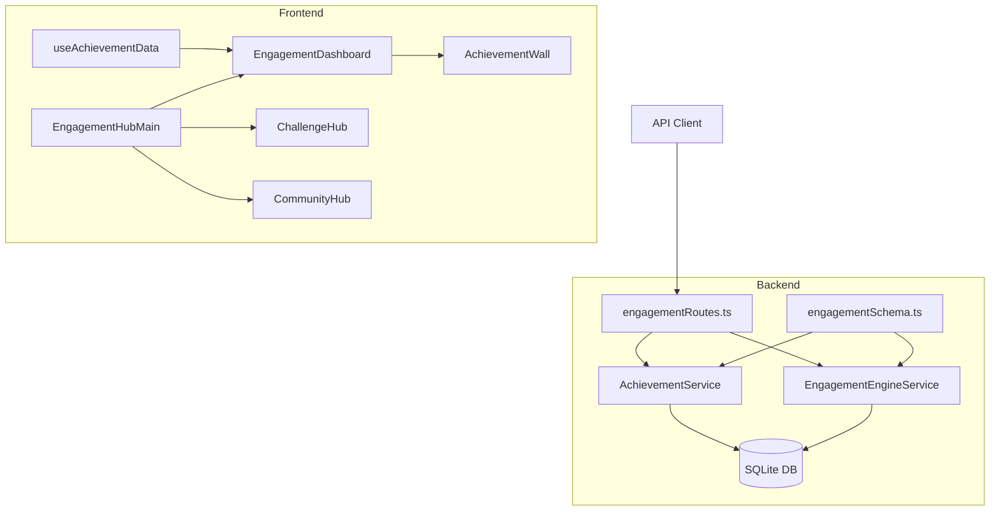

# Technical Debt Resolution Plan - Spartan Hub

**Created:** January 31, 2026
**Status:** In Analysis

---

## Executive Summary

Analysis of the Spartan Hub project reveals a mature Phase 9 implementation with solid gamification foundations, but with identified technical debt areas requiring attention. This plan outlines prioritized remediation strategies.

---

## Current Project Status

### ✅ Phase 9 - Engagement & Retention System (Complete)

| Component | Status | Details |
|-----------|--------|---------|
| Database Schema (`engagementSchema.ts`) | ✅ Complete | Zod schemas, enums, SQL definitions |
| AchievementService | ✅ Complete | Achievements, badges, challenges, points, XP |
| EngagementEngineService | ✅ Complete | Challenges, streaks, social, events tracking |
| API Routes (`engagementRoutes.ts`) | ✅ Complete | Full REST API for all features |
| Frontend Components | ✅ Complete | Dashboard, ChallengeHub, CommunityHub, AchievementWall |
| Frontend Hooks | ✅ Complete | `useAchievementData` for data aggregation |
| Tests | ✅ Complete | Unit tests for EngagementEngineService |

### 🔄 Technical Debt Identified

| Category | Severity | Files Affected | Description |
|----------|----------|----------------|-------------|
| TypeScript Strict Mode | Medium | ~244 errors | Backend type violations |
| API Error Handling | Low | `GroqProvider` | Expected errors in tests |
| `any` Type Usage | Medium | 25+ files | Type safety violations |
| WebkitAudioContext | Low | `audioService.ts` | Type assertion needed |

---

## Technical Debt Details

### 1. TypeScript Strict Mode Violations (~244 errors)

**Affected Areas:**
- ML Routes: ~40 errors
- Controllers: ~25 errors
- ML Services: ~50 errors
- RAG Services: ~30 errors
- Tests: ~60 errors
- Other: ~39 errors

**Reference:** See `plans/PLAN_CORRECCION_ERRORES_TYPESCRIPT_2026.md` for detailed breakdown.

### 2. `any` Type Usage (Type Safety)

**Files Requiring Attention:**

| File | Line | Issue |
|------|------|-------|
| `src/utils/inputSanitizer.ts` | 143, 189 | Generic `any` parameters |
| `src/services/httpService.ts` | 89, 100, 118 | Untyped data parameters |
| `src/services/formAnalysisEngine.ts` | 75 | Untyped landmark data |
| `src/services/analyzers/*.ts` | Various | Type assertions for point geometry |
| `src/hooks/useOfflinePersistence.ts` | 152 | Untyped cache data |

### 3. API Error Handling (Test Output)

**Issue:** GroqProvider test generates expected API error logs

**Files:**
- `backend/src/services/ai/providers/GroqProvider.ts`
- `backend/src/__tests__/ai/providers/GroqProvider.test.ts`

**Status:** These appear to be expected error scenarios being tested, not actual bugs.

---

## Recommended Actions

### Priority 1: Quick Wins (1-2 days)

1. **Fix `webkitAudioContext` type**
   - File: `src/services/audioService.ts:20`
   - Action: Use proper type or extend Window interface

2. **Add proper types to HTTP service**
   - File: `src/services/httpService.ts`
   - Action: Generic type parameters for POST/PUT/PATCH

3. **Address test-generated API errors**
   - Verify these are expected error scenarios
   - Consider adding `@ts-expect-error` or proper error mocking

### Priority 2: TypeScript Compliance (1 week)

1. **Follow existing plan** - `plans/PLAN_CORRECCION_ERRORES_TYPESCRIPT_2026.md`
2. **Target:** Reduce errors from ~244 to <50
3. **Focus areas:**
   - ML Routes and Services
   - Controllers
   - Test files

### Priority 3: Long-term Improvements (2-4 weeks)

1. **Replace `any` with proper types**
   - Create specific interfaces for form analysis metrics
   - Add cache data interfaces
   - Define point/geometry types

2. **Enhance error handling**
   - Create custom error classes
   - Implement proper error boundaries

3. **Add integration tests**
   - Test engagement system end-to-end
   - Verify API error scenarios

---

## Architecture Diagram

---

## Next Steps

1. **Confirm technical debt priorities** with stakeholders
2. **Begin Priority 1 fixes** - Quick wins for immediate improvement
3. **Continue TypeScript error correction** using existing plan
4. **Add comprehensive tests** for engagement features

---

## Files Modified/Referenced

- `spartan-hub/backend/src/schemas/engagementSchema.ts` ✅
- `spartan-hub/backend/src/services/achievementService.ts` ✅
- `spartan-hub/backend/src/services/engagementEngineService.ts` ✅
- `spartan-hub/backend/src/routes/engagementRoutes.ts` ✅
- `spartan-hub/src/components/engagement/*.tsx` ✅
- `spartan-hub/src/hooks/useAchievementData.ts` ✅
- `plans/PLAN_CORRECCION_ERRORES_TYPESCRIPT_2026.md` 📋
